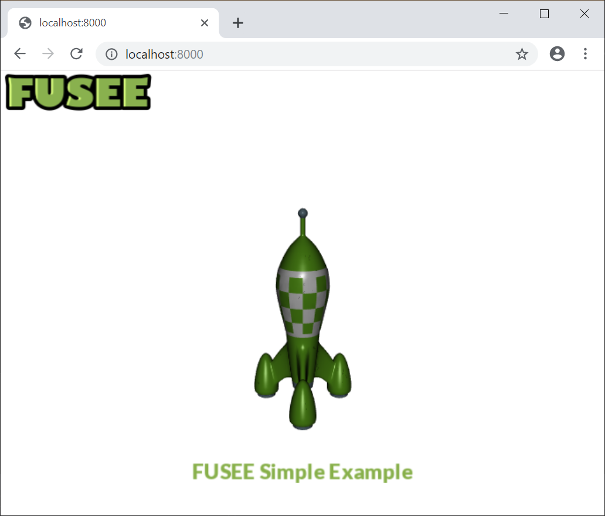
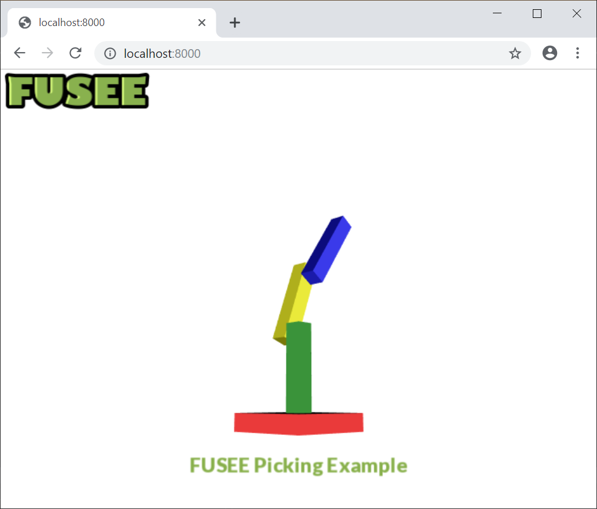

  > ⚠️ **This page shows some examples of our upcoming Web Assembly support enabling FUSEE applications to run in web browsers**  

## [Rocket](rocket/index.html)
__[FUSEE Rocket](rocket/index.html) is a simple example which demonstrates asset loading (shaders, serialized *.fu scene files, textures, fonts) as well as our responsive GUI system.__

The source code can be found here: [Github](https://github.com/FUSEEProjectTeam/Fusee/tree/develop_wasm/Examples/Complete/Simple/WebAsm)

---

## [Picking](picking/index.html)
**[FUSEE Picking](picking/index.html) demonstrates picking.**

The source code can be found here: [Github](https://github.com/FUSEEProjectTeam/Fusee/tree/develop_wasm/Examples/Complete/Picking/WebAsm)