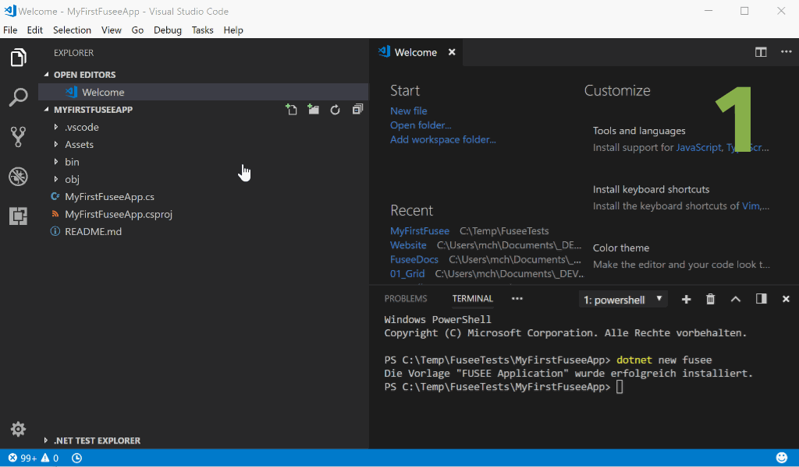

>  **NOTE**: Developing FUSEE Apps is currently only supported on Windows operating systems.

-------------

After a successful
[FUSEE Installation](../getting-started/install-fusee.md) you might want to create your first FUSEE App in 
Visual Studio Code.

## Create a simple FUSEE App

1. Create a new empty directory somewhere on your hard-disk. This will contain your first FUSEE App.
   Name the directory `MyFirstFuseeApp`.

2. Open the the directory in Visual Studio Code in one of the following ways.
   - ***Either*** Open VS Code, click on "File &rarr; Open Folder" from the menu and select the `MyFirstFuseeApp` directory. 
   - ***Or*** In Windows Explorer, right-click on the `MyFirstFuseeApp` directory and select "Open With Code" from the context menu.
   - ***Or*** In a Console (Command Prompt or PowerShell), `cd` to `MyFirstFuseeApp` and enter `code .` at the command line.

3. In Visual Studio Code (with the open folder), Open the integrated terminal ("View &rarr; Integrated Terminal" from the menu, ``Ctrl+` `` on English 
   keybards, `Ctrl+Ö` on German keyboards).

4. In the terminal window at the lower part of VS Code, enter `dotnet new fusee`.
   This will populate your `MyFirstFuseeApp` folder with all necessary sources, assets and project
   settings needed to build a simple FUSEE app.

#### Screen Cast: Create a simple FUSEE App

-------------

## Build and run the App

1. In Visual Studio Code, open the *Debug Side Bar* by clicking on the debug symbol ("No Bugs Roadsign") on the left.

2. On top of the Debug Side Bar, make sure that the drop-down box next to the green arrow shows `Debug in FUSEE Player`.
   If not, select this option from the drop-down box.

3. Click on the green arrow to build your new FUSEE App and start it in the Debugger. As your new FUSEE App was
   never built before, the build process might take some time.

4. As a result, the FUSEE Player application starts and runs the code from your FUSEE application. Try to 
   view the rocket from different angles by clicking and dragging the mouse.

#### Screen Cast: Build and run the App

If you're curious how your FUSEE App works look at the source code file `MyFirstFuseeApp.cs` that was generated 
in your project directory.

-------------

## Things to know

Now that you created your first FUSEE App, there are some things to know about the build process.

### Console commands
All steps mentioned above are individually available as commands from within Visual Studio Code
as well as from the command line. Make sure to `cd` to the root directory of your project. In our
example above this would be `MyFirstFuseeApp/`.

Build/Publish/Run Step |  Visual Studio Code command  |  Console command line 
-----------------------|------------------------------|-----------------------
Build                  | Tasks &rarr; Run Build Task... &rarr; build | `dotnet build`
Publish .FUZ App       | Terminal &rarr; Run Build Task... |
Publish Desktop App    | Tasks &rarr; Run Build Task... &rarr; Publish FUSEE Desktop App | `fusee publish -p Desktop`

### Publishing as Desktop App

As mentioned in the table above, there is a build step available allowing you to 
publish your Desktop App (as .exe file). The result will be written to `pub/Desktop`.

### Publishing as .FUZ App
To create the project as .FUZ, you have to select the build task in Visual Studio Code. 
Either in the Terminal tab under Run Build Task or with the key combination CTRL-Shift-B. 
The file is then in the bin folder

### Project folder naming rules

When creating new FUSEE Apps in the way described above, several things in your new project will be named 
after your project folder. Make sure your folder name obeys to the C# identifier rules. Roughly, that means:

- First character may be only letter (`a`-`z`, `A`-`Z`) or underscore (`_`).
- All other characters may be letter, underscore or number (`0`-`9`).
- **Don't** start the folder name with a number.
- **Don't** use punctuation or other special characters in the folder name, not even a minus (`-`)!

  

